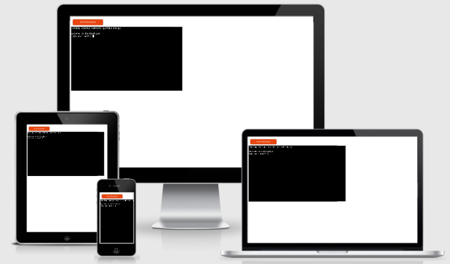
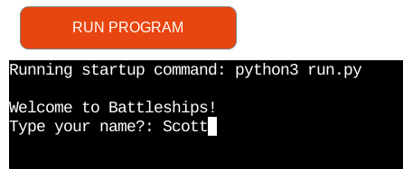
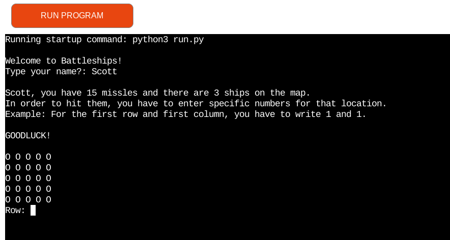
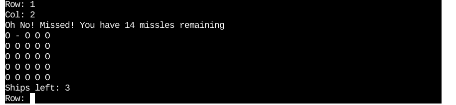
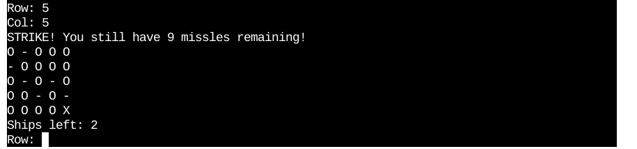
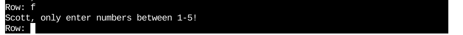
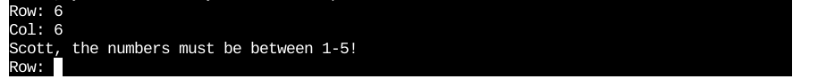
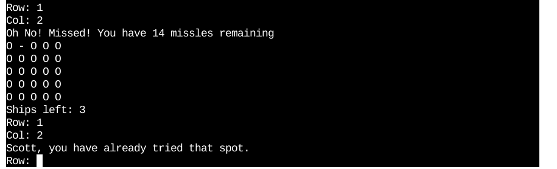
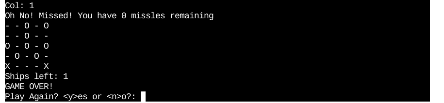
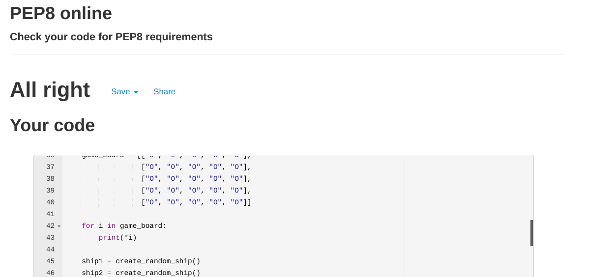

# **Battleships**
This is a python led game built by Heroku. The game runs on Code Institute's mock terminal. The game is single player with the objective to destroy 3 randomly placed ships on a 5x5 grid board with 15 wrong attempts.

The live site to Battleships : [Click Here](https://battleships144.herokuapp.com/)

## **Responsive Design**

## **Features**

### <strong>Opening</strong>

- The opening of the program requires user input to assign a user name. As in today's society, naming and identity is a big consideration, no limitations to user input have been placed here. The user input here will connect to f-strings throught the program.
 

### <strong>Beginning of the Game</strong>

- This is the beginning of the game. Functions to build the game and allow for game play are called and operational. 

### <strong>Missed a ship</strong>

- The missles with reduce by 1 and the board updated to reflect a miss

### <strong>Hit a ship</strong>

- The board will update to reflect a strike and the missles remaining stays the same

### <strong>Wrong data validation</strong>

- This message occurs if the user inputs anything other than an integer

- This message occurs if the user inputs a number not within the range of the board

- This message occurs if the user inputs a guess they have tried already

### <strong>Ask to play again</strong>

- If the user wants to play again, the can. An empty game board will appear and the game functions reset.

### <strong>Answer of 'no' to play again</strong>

- A goodbye message appears and the program shuts down with sys.exit()

## **Future features**
 A level based system will be introduced. This will allow players to choose from Easy, Medium, Hard modes.
- Easy = 15 missles
- Medium = 10 missles
- Hard = 5 missles

## **Bugs**
 I have manually tested the program

 - Data validation tested within GitPod's terminal
 - Data validation tested in the deployed site on Heroku
 - Passed the PEP8 online validator
 - Step by step running through Python Tutor

 ## **Testing**
- Testing was completed by PEP8 online checker with no issues.
 

 `Battleships` is a bug free program! 

## **Deployment**
- I deployed my site on Heroku. I followed instructions from [Code Institue](https://codeinstitute.net/se/5-day-coding-challenge/?utm_term=code%20institute&utm_campaign=CI+-+SWE+-+Search+-+Brand&utm_source=adwords&utm_medium=ppc&hsa_acc=8983321581&hsa_cam=14660337051&hsa_grp=134087657984&hsa_ad=546251838233&hsa_src=g&hsa_tgt=kwd-319867646331&hsa_kw=code%20institute&hsa_mt=e&hsa_net=adwords&hsa_ver=3&gclid=Cj0KCQiA15yNBhDTARIsAGnwe0UQv6qv0SwHT3sAGJ6uF8SdJR6nThPCUkVs_yMLPFdVaHSEq1RtzB8aAtAuEALw_wcB) and deployed my site.
- My deployed site url: [https://battleships144.herokuapp.com/](https://battleships144.herokuapp.com/)

## **Credits**

### <strong>Code Institute</strong>
- This project is a projection of the learning material learnt on Code Institute's learning platfom.
- The template for this project
- Project idea 

## **Disclaimer**

This site was built for educational purposes only. All rights to the title name, battleships idea or other remain with the copyright owners. `Battleships` is an educational project by the developer.

Developer: Scott Quinn

